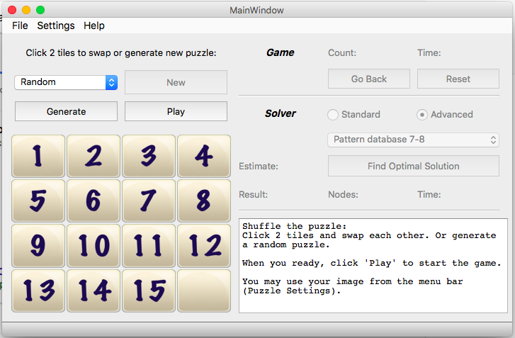

### Preface
I finished the programming assignment of [8puzzle] by Princeton University on Coursera.  It use priority queue to implement [A* algorithm] with Manhattan distance .  But it is not able to solve all boards of [15 slide puzzle] due to out of memory.  It can solve the puzzle about 50 steps.  I try to build an optimal solver for 15 puzzle.

### 15 puzzle optimal solver using additive pattern database 7-8
I search the information on internet.  IDA* ([Iterative deepening A*]) takes less memory because it did not stored the nodes.  I try it and it can solve the puzzle about 60 steps.  [Walking Distance by Ken'ichiro Takahashi] is more efficient than Manhattan distance.  I replaced it and it can solve the puzzle about 70 steps.  [Pattern database] seems the best solution and the concept is clear.  

Unlike the 8 puzzle, full pattern database for 15 slide puzzle is too large, I have to use additive pattern database.  The most common statically partitioned additive pattern databases for 15 puzzle are 5-5-5, 6-6-3 or 7-8.  Generate 5-5-5 or 6-6-3 patterns are straight forward, but 7-8 pattern is challenge due to memory issue.  For a group of 8 tiles, there are 518,918,400 (40320 tiles combinations x 12870 group 8 pattern) patterns.  Since [Herbert Kociemba's windows program] can build the 7-8 pattern using c++, I decide to build a java version.

While I learn the technique of Walking Distance by Ken'ichiro Takahashi, I figure out a way to generate the 7-8 pattern with minimum 2GB ram and takes about 2.5 - 3 hours.  First separate the tile and format components, and generate the links in [PatternElement.java].  Then I use these components to generate the patterns in [PatternDatabase.java].  Generation time:  
  * [pattern 5-5-5] 15 seconds
  * [pattern 6-6-3] 2 minutes
  * [pattern 7-8] 2.5+ hours (10 mins for group 7 and 2.5 hrs for group 8)

*** Highly recommended to [download] the pre-generated database files from the cloud storage for pattern 7-8.

### Enhancement - optimization
After I finished my 15 puzzle optimal solver, most of the puzzles are solved within a second.  Only a few puzzles still take up to 2 minutes to solve. 
<pre>
             0 15  8  3     6  5  9 13    11  5  9 13     0 15  8 13     0 15  8 13     0 11  9 13
            12 11  7  4     2  1 10 14     2  6 10 14    12 11  3  7    12 11  9 10    12 15 10 14
            14 10  6  5     3  7  0 15     3  7  0 15    14  9  6  2    14  3  6  2     3  7  6  2
             9 13  2  1     4  8 12 11     4  8 12  1 	  4 10  5  1     4  7  5  1     4  8  5  1
Estimate:            48             58             58             58             62             66
Moves:               70             72             74             76             78             80
Time:            111.4s          56.6s          13.7s           5.8s           5.7s           3.5s
Nodes:        492357819      231367077       46383751       20187376       18363209       12715201
</pre>
I analysis the behavior of 15 puzzle and my solver.  I added [symmetry (see Section 4)] reduction and circular reduction to speed up the process. It improve the process time from 2 mintue to 45 seconds.
<pre>
Added symmetry reduction:
Time:             57.3s          27.9s           7.1s           2.9s           2.8s           3.2s
Nodes:        239416302      114874953       24447275       10207716        9123607       11456863
Added circular reduction:
Time:             44.2s          22.4s           5.9s           2.5s           2.4s           2.8s
Nodes:        177653815       89470609       20109676        8436494        7693686        9785986
</pre>
I also added starting ordering detection to increase the possibility to solve first move depth increment.  The starting order may vary each depth instead of hard coded the fixed order such as Right -> Down -> Left -> Up.  

Read [Solver Enhancement - standard version] for details.  

### Enhancement - [self learning feature]
45 seconds seems pretty good, but I still not satisfy with it.  The maximum estimate is 68 and the maximum moves is 80, so the IDA* has to loop through all nodes that will not have solution before it reach the solution depth.  If I can boost the estimate to the solution depth, it will drop the search time dramatically.   

I started with 17 known 80 moves puzzles as reference boards to boost the estimate over 68.  It works but still missed a lot.  I applied the same concept to any puzzle that takes over 8 seconds to solve, the solver with pattern database 7-8 will automatically stored it as reference board.  Also stored first 8 solution moves to boost the search time within a second.  

Now the solver has the self learning feature.   When it accumulate enough reference boards, the solver will solve any puzzle within 8 seconds (the preset cutoff setting) eventually.  

Read [Solver Enhancement - advanced version] for details.

----
### Connection options - Support standalone application and multi-users application.
* Standalone for single use on local machine - reference collection will be stored in a local file.  If user started multiple applications on the same machine.  Reference collection will not be in sync.
* Remote server using RMI (Remote Method Invocation) support multiusers application - Mulitple applications will access the same reference collection instance and storage through RMI service.  If connection is lost, it will resume to standalone connection without terminate the application.  

Console applications may detect the server connection lost, restore in standalone or standard version temporary.  When conection is back, it will switch back to remote connection automatically.  

Reference collection administrator allow to change the settings, such as:  
  cutoff limit, reset and restore to default setting, system update and refresh the data file etc...  
Changing the setting is not allow during the remote server is running.  

Same for the remote server, it cannnot start the remote service during the administrator is using.  

### GUI - 15 puzzle game and solver 2 in 1 ([screenshots] / [youtube demo])
  
My gui application written in pyqt5 version 5.6.  It access my java modules using py4j.  The python program will start and close the java gateway server by itself.  
* It can play with numbers or any image in the local folder.  
* Choice of auto generate puzzle: Random, Easy (Manhattan distance 5 - 24), Moderate (Manhattan distance 21 - 45), Hard (Manhattan distance 41 and over)
* The player can solve the puzzle, the program will count the total time.  
* Or let the program search for solution.  Once solution found, it will playback the moves automatically.  
[System requirements and installation]  (Database ready, 6145 reference collection)

### Console applications ([screen recordings] on youtube)
Download and unzip [ConsoleApp15Puzzle.zip]  (Database ready, initial set)  
Start from terminal: java -jar ConsoleApp15Puzzle.jar option_choice_below  
* 1 - demo [self learning feature] | text file [sample output 1]  
* 2 - [compare enhancement] | text file [sample output 2]  
* 3 (default) - [compare heuristic functions]  | text file [sample output 3]  
* 4 - [custom pattern]  
* 5 - [solver with display solution]  
* 6 - [stats] solve a number of puzzle, calculate the average time and a timeout counter of search.  

Notes: runtime takes a little longer on youtube due to screen recording.

### Heuristic Functions - 7 heuristic functions to choose from:  
Average search time of 250 random boards with Standard version 
<pre>
Manhattan Distance                                         (1.57s, exclude 42 timeout at 10s)
Manhattan Distance with Linear Conflict                    (1.07s, exclude 14 timeout at 10s)
Walking Distance                                           (0.95s, exclude 10 timeout at 10s)
Walking Distance + Manhattan Distance with Linear Conflict (0.68s, exclude  5 timeout at 10s)
Additive Pattern Database 5-5-5 + Walking Distance         (0.28s)
Additive Pattern Database 6-6-3 + Walking Distance         (0.15s) 
Additive Pattern Database 7-8                              (0.0046s)
                 (5000 random boards)     standard version (0.0049s)
                                          advanced version (0.0071s)
              (500 random hard boards)    standard version (0.71s, exclude  9 timeout at 10s)
                                                           (0.43s, exclude  4 timeout at 10s)
                                          advanced version (0.31s, all solved)
Update: Average time based on 6145 reference boards (March 27, 2017) for advanced version.  
Notes: Advanced version takes slightly longer average time to solve the random puzzle due to 
       additional checking.  But take less time to slove the hard puzzle.  
       Result may vary due to random puzzles and system performance.
</pre>

[screenshots]: https://github.com/mwong510ca/15Puzzle_OptimalSolver/tree/master/screenshots
[youtube demo]: https://youtu.be/yswhj-ZHta4
[15 slide puzzle]: https://en.wikipedia.org/wiki/15_puzzle
[8puzzle]: http://algs4.cs.princeton.edu/24pq/
[A* algorithm]: https://en.wikipedia.org/wiki/A*_search_algorithm
[Iterative deepening A*]: https://en.wikipedia.org/wiki/Iterative_deepening_A*
[Pattern database]: https://www.aaai.org/Papers/JAIR/Vol22/JAIR-2209.pdf
[symmetry (see Section 4)]: https://heuristicswiki.wikispaces.com/file/view/Searching+with+pattern+database.pdf
[Herbert Kociemba's windows program]: http://kociemba.org/fifteen/fifteensolver.html
[Walking Distance by Ken'ichiro Takahashi]: http://www.ic-net.or.jp/home/takaken/e/15pz/index.html
[PatternElement.java]: https://github.com/mwong510ca/15Puzzle_OptimalSolver/blob/master/PatternElement.java%20-%20details.md
[PatternDatabase.java]: https://github.com/mwong510ca/15Puzzle_OptimalSolver/blob/master/PatternDatabase.java%20-%20details.md
[Solver Enhancement - standard version]: https://github.com/mwong510ca/15Puzzle_OptimalSolver/blob/master/Solver%20Enhancement%20-%20Standard%20version.md
[Solver Enhancement - advanced version]: https://github.com/mwong510ca/15Puzzle_OptimalSolver/blob/master/Solver%20Enhancement%20-%20Advanced%20version.md
[download]: https://my.pcloud.com/publink/show?code=kZSoaLZgNeLhO2eu0RQcu9D2aXeOFgtioUV
[pattern 5-5-5]: https://github.com/mwong510ca/15Puzzle_OptimalSolver/blob/master/output/default%20pattern%205-5-5.txt
[pattern 6-6-3]: https://github.com/mwong510ca/15Puzzle_OptimalSolver/blob/master/output/default%20pattern%206-6-3.txt
[pattern 7-8]: https://github.com/mwong510ca/15Puzzle_OptimalSolver/blob/master/output/default%20pattern%207-8.txt
[self learning feature]: https://youtu.be/QBhoM1RySPQ
[compare enhancement]: https://youtu.be/lKFi-05uIMc
[compare heuristic functions]:  https://youtu.be/hdHWnHxvX5A 
[custom pattern]: https://youtu.be/sY6JU2ElhdI
[solver with display solution]: https://youtu.be/3Exp3QT5s_A
[stats]: https://youtu.be/TBsui-_b74A
[sample output 1]: https://github.com/mwong510ca/15Puzzle_OptimalSolver/blob/master/output/console_output1.txt
[sample output 2]: https://github.com/mwong510ca/15Puzzle_OptimalSolver/blob/master/output/console_output2.txt
[sample output 3]: https://github.com/mwong510ca/15Puzzle_OptimalSolver/blob/master/output/console_output3.txt
[System requirements and installation]: https://github.com/mwong510ca/15Puzzle_OptimalSolver/tree/master/gui(pyqt5)
[ConsoleApp15Puzzle.zip]: https://my.pcloud.com/publink/show?code=XZbosNZLoFkgiX8YkyUzRqgM7ubdHiFaqmy
[screen recordings]: https://www.youtube.com/playlist?list=PLRnfrf3rzEFkDcssdh75pHjID6sWLiIGF
