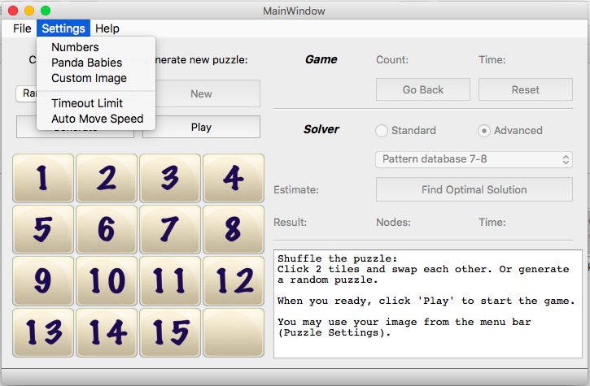
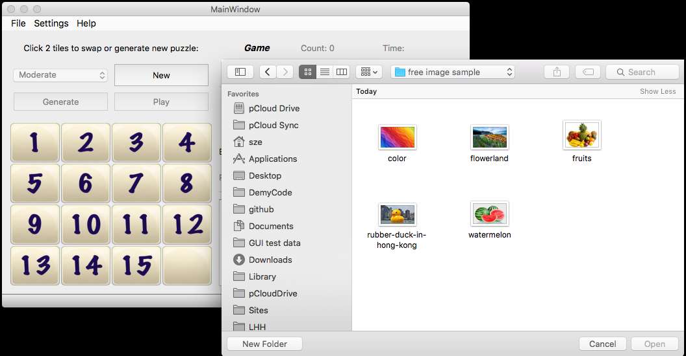
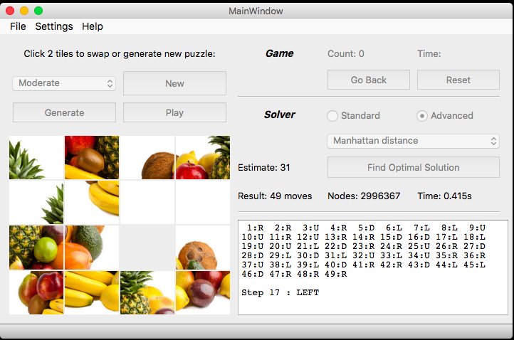
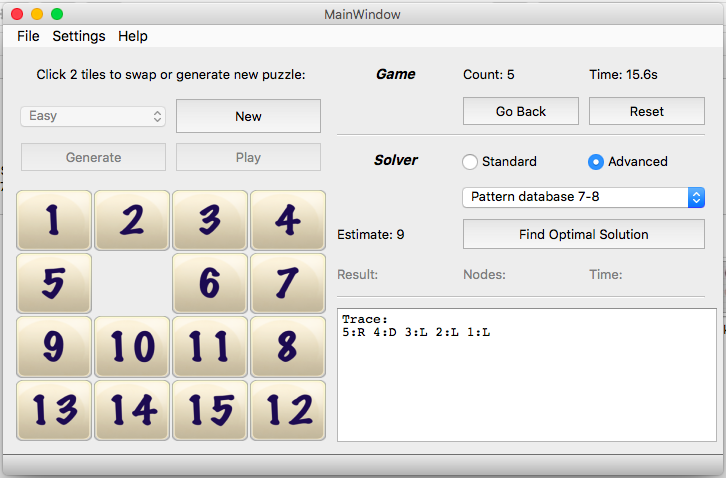
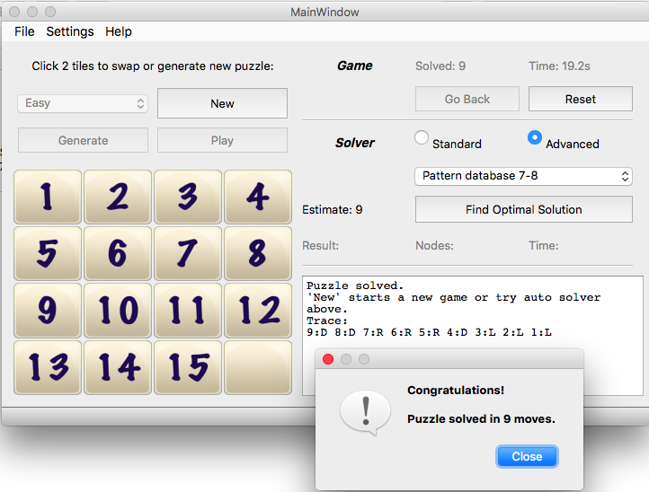
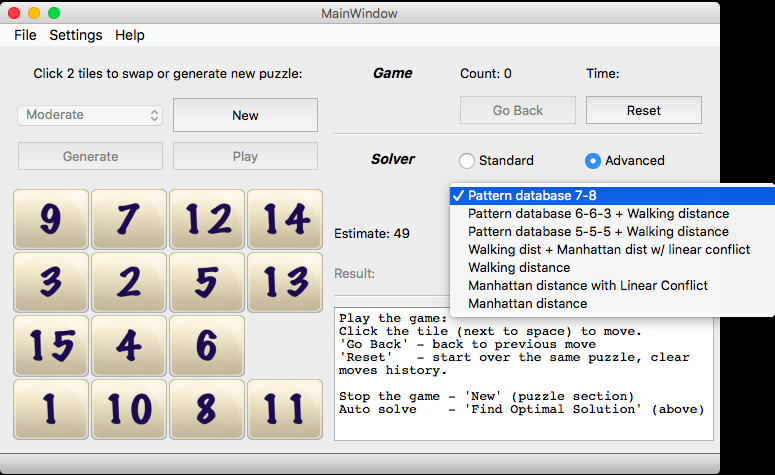
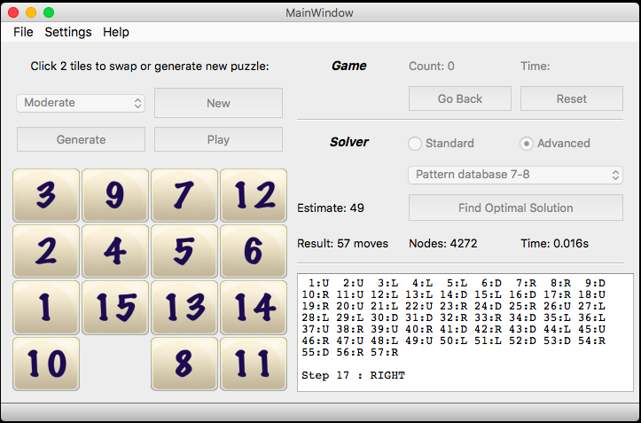

Start up screen:  
    
  
Menu settings:  
  

Change to local image:  
  

Play with local image:  
  

Play the game:  
  

Game win, puzzle solved:  
  

Solver options:  
  

Auto solved:  
  
